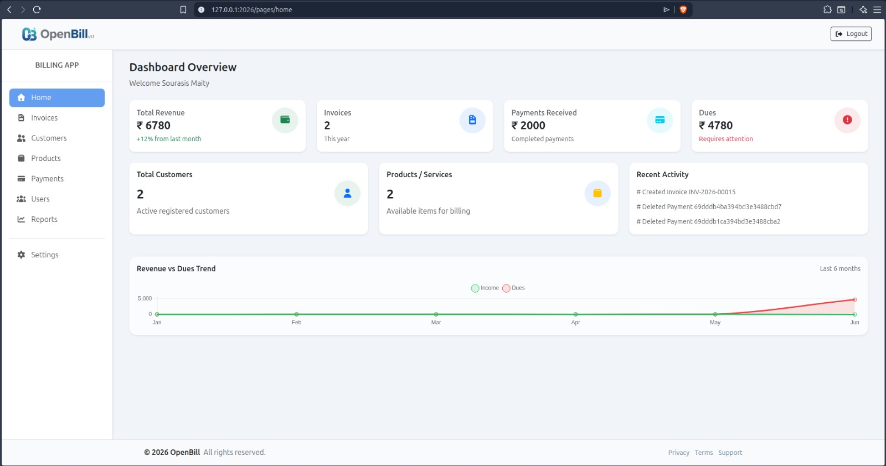
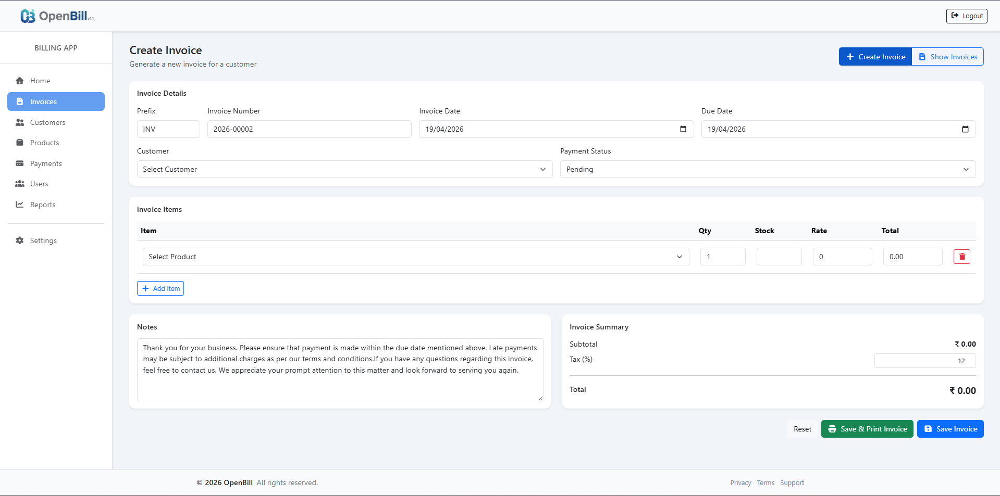
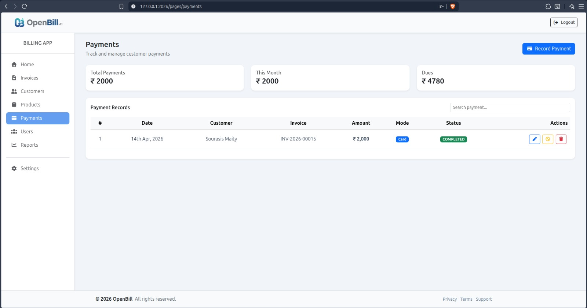
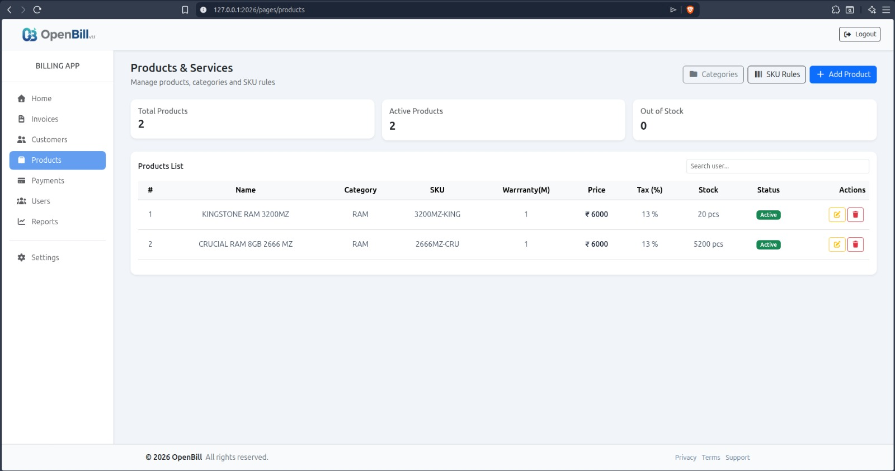
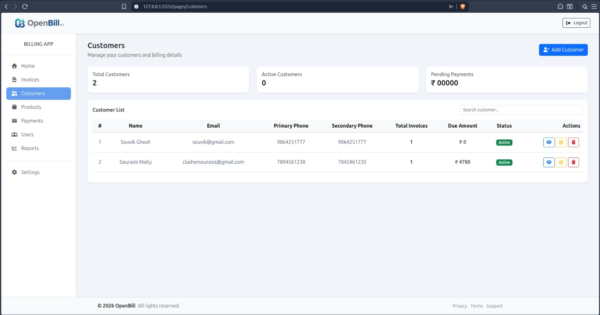
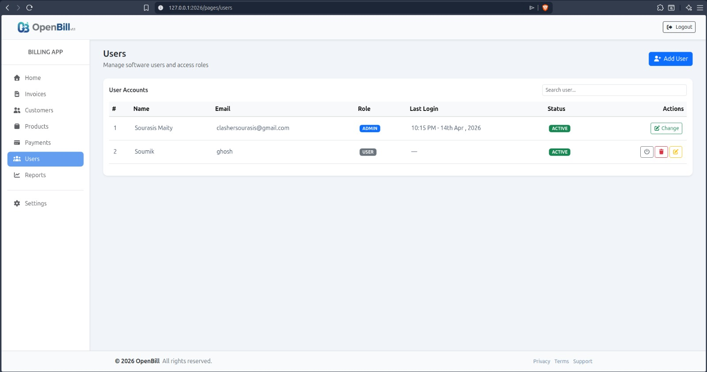
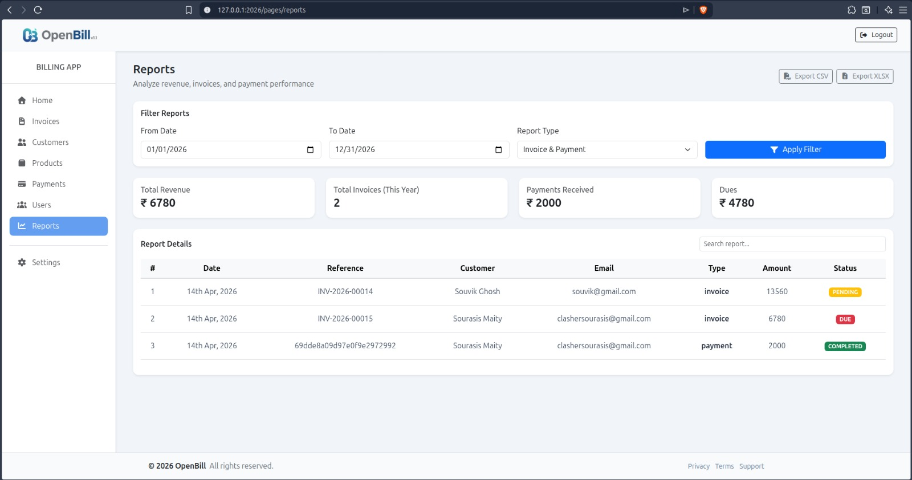
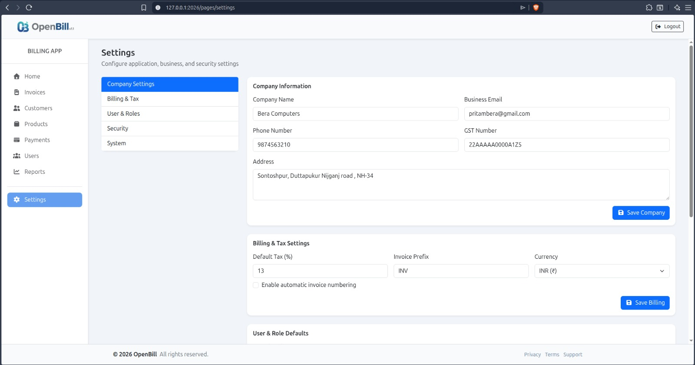

# 📋 OpenBill - Professional Billing & Invoice Management System


_A professional, open-source billing and invoice management system designed for small to medium-sized businesses. Built with modern technologies for beautiful UI, flagship features, and simple operations._

---
---

## ✨ Features

OpenBill provides comprehensive billing management with the following features:

### 🏠 Dashboard - Real-Time Financial Overview

Monitor your business at a glance with a comprehensive dashboard showing key metrics and quick insights.

**Key Metrics:**

- Total invoices count for current year
- Revenue tracking
- Outstanding dues
- Payment status overview
- Quick action buttons



---

### 📄 Invoice Management

Complete invoice creation, management, and tracking system with professional features.

**Features:**

- ✅ Create professional invoices with auto-numbering
- ✅ Add multiple line items with product details
- ✅ Automatic tax calculation (configurable tax percentage)
- ✅ Track invoice status (pending, paid, due, cancelled)
- ✅ Set custom due dates
- ✅ PDF export using Puppeteer for high-quality documents
- ✅ Add notes and special instructions
- ✅ Audit trail (created by user tracking)
- ✅ Payment amount tracking
- ✅ Invoice history and archival



---

### 💳 Payment Management

Advanced payment tracking and management system supporting multiple payment methods.

**Features:**

- ✅ Record payments with multiple payment modes:
  - Cash
  - UPI
  - Card
  - Bank Transfer (BT)
- ✅ Track payment status (pending, completed, cancelled)
- ✅ Link payments to specific invoices
- ✅ Track remaining due amounts
- ✅ Payment date logging
- ✅ Add payment notes and references
- ✅ Generate payment reports
- ✅ Automated payment reconciliation



---

### 📦 Product Management

Centralized product/service catalog with inventory management.

**Features:**

- ✅ Add and manage product inventory
- ✅ Track product SKU and details
- ✅ Set product pricing and rates
- ✅ Manage product categories
- ✅ Stock level monitoring
- ✅ Product edit and deletion
- ✅ Integration with invoice items
- ✅ Bulk product operations



---

### 👥 Customer Management

Comprehensive customer database and relationship management.

**Features:**

- ✅ Create and maintain customer profiles
- ✅ Store customer contact information (email, phone)
- ✅ Track customer address and billing details
- ✅ Customer transaction history
- ✅ Customer balance tracking
- ✅ Customer search and filtering
- ✅ Link invoices to customers
- ✅ Customer status management



---

### 👨‍💼 Multi-User Management

Role-based user management with permission control for team collaboration.

**Features:**

- ✅ Create multiple user accounts
- ✅ Role-based access control (Admin, User roles)
- ✅ User status management (active/deactivated)
- ✅ Login attempt tracking
- ✅ Account lockout after failed attempts
- ✅ Last login timestamp tracking
- ✅ Secure password hashing with bcrypt
- ✅ JWT token-based authentication
- ✅ User activity logging
- ✅ Password protection and security



---

### 📊 Report Management

Generate comprehensive reports for business insights and analysis.

**Features:**

- ✅ Financial reports (income, expenses, profit)
- ✅ Invoice reports with filtering
- ✅ Payment reports and reconciliation
- ✅ Customer-wise reports
- ✅ Date range filtering
- ✅ Export to multiple formats:
  - Excel (.xlsx)
  - CSV (.csv)
  - PDF
- ✅ Customizable report parameters
- ✅ Monthly/Yearly analytics
- ✅ Visual data representation



---

### ⚙️ Dynamic Settings

Flexible application configuration to match your business requirements.

**Features:**

- ✅ Business information configuration (company name, address)
- ✅ Tax settings (GST/VAT percentages)
- ✅ Session timeout configuration
- ✅ Maximum login attempts setting
- ✅ Invoice numbering format
- ✅ Payment gateway settings
- ✅ Email notification settings
- ✅ Currency and locale preferences
- ✅ Backup and restore functionality
- ✅ System-wide configuration management



---

## 🎨 Design Philosophy

OpenBill is built on three core principles:

- **Beautiful**: Modern, intuitive, and visually appealing user interface with responsive design for all devices
- **Flagship**: Enterprise-grade features and reliability with professional billing capabilities
- **Simple**: Straightforward workflow requiring minimal learning curve for end users

Our philosophy emphasizes:

- User-centric design
- Intuitive navigation
- Professional UI/UX
- Accessibility
- Performance optimization
- Data security

---

## 🛠️ Tech Stack

| Component               | Technology                        |
| ----------------------- | --------------------------------- |
| **Runtime**             | Node.js (v14+)                    |
| **Backend Framework**   | Express.js v5.2.1                 |
| **Database**            | MongoDB with Mongoose v9.0.2      |
| **Frontend Templating** | EJS v3.1.10                       |
| **Authentication**      | JWT (JSONWebToken) + Bcrypt       |
| **Password Hashing**    | Bcrypt v6.0.0                     |
| **PDF Generation**      | Puppeteer v24.34.0                |
| **Excel Export**        | ExcelJS v4.4.0                    |
| **CSV Export**          | json2csv v6.0.0-alpha.2           |
| **Frontend**            | HTML5, CSS3, Vanilla JavaScript   |
| **Middleware**          | cookie-parser, CORS, Express.json |
| **Development Tool**    | Nodemon v3.1.11 (dev environment) |

---

## 🚀 Setup Instructions

### Prerequisites

- Node.js (v14 or higher)
- npm (v6 or higher)
- MongoDB Atlas account (cloud database) or local MongoDB instance
- Git
- Text editor or IDE (VS Code recommended)

### Step-by-Step Installation

#### Step 1: Clone the Repository

```bash
git clone https://github.com/huntersourasis/OpenBill.git
cd OpenBill
```

#### Step 2: Install Dependencies

```bash
npm install
```

This will install all required packages:

- Express.js, Mongoose, EJS, JWT, Bcrypt
- Puppeteer (PDF generation)
- ExcelJS, json2csv (report export)
- Cookie-parser, CORS, and other middleware

#### Step 3: Configure Environment Variables

Create a `.env` file in the root directory with your configuration:

```env
# MongoDB Connection
MongoURI="mongodb://<YOUR_USERNAME>:<YOUR_PASSWORD>@ac-81e48gj-shard-00-00.hejoktu.mongodb.net:27017,ac-81e48gj-shard-00-01.hejoktu.mongodb.net:27017,ac-81e48gj-shard-00-02.hejoktu.mongodb.net:27017/openbill?ssl=true&replicaSet=atlas-ak2mkk-shard-0&authSource=admin&appName=OpenSource"

# Server Configuration
PORT=3000
NODE_ENV="development"

# JWT Secret (use a strong random string)
JWT_SECRET="your_super_secret_jwt_key_here_change_this_in_production"

# Optional: Email Configuration (for notifications)
SMTP_HOST="smtp.gmail.com"
SMTP_PORT=587
SMTP_USER="your_email@gmail.com"
SMTP_PASS="your_app_password"
```

**Important Steps:**

1. Replace `<YOUR_USERNAME>` and `<YOUR_PASSWORD>` with your MongoDB Atlas credentials
2. Generate a strong `JWT_SECRET` key
3. Update email settings if you want email notifications
4. Make sure MongoDB URI is correctly formatted

**MongoDB Atlas Setup:**

- Create a free account at [MongoDB Atlas](https://www.mongodb.com/cloud/atlas)
- Create a cluster
- Add your IP address to the Network Access whitelist (Also 0.0.0.0 for skip DNS checking)
- Create a database user with username and password
- Get the connection string and replace credentials

#### Step 4: Setup Database

```bash
npm run setup
```

This command will:

- Connect to MongoDB
- Create an admin user with:
  - Email: `admin@gmail.com`
  - Password: `sourasis`
- Initialize database indexes
- Set up default collections

**⚠️ Important:** Change the default admin credentials immediately after first login!

#### Step 5: Start Development Server

```bash
npm run dev
```

The application will be available at:

- **URL:** `http://localhost:2026`
- **Admin Email:** `admin@gmail.com`
- **Admin Password:** `sourasis`

You should see output like:

```
NodeJS Server is running on  : http://127.0.0.1:3000
MongoDB Connected
```

### Production Deployment

For production environment:

```bash
# Build and start for production
NODE_ENV=production npm start
```

**Production Checklist:**

- ✅ Update JWT_SECRET with a strong random key
- ✅ Change default admin password
- ✅ Enable HTTPS/SSL
- ✅ Set up proper MongoDB backups
- ✅ Configure firewall rules
- ✅ Enable CORS for your domain only
- ✅ Set up monitoring and logging
- ✅ Use environment variables for sensitive data

### Update Scripts

```bash
# Update to latest version from git
npm run update
```

---

## 📁 Project Structure

```
OpenBill/
│
├── public/                          # Static files
│   ├── css/                         # Stylesheets
│   │   ├── buttons.css              # Button styles
│   │   ├── cards.css                # Card component styles
│   │   ├── error.css                # Error page styles
│   │   ├── footer.css               # Footer styles
│   │   ├── nav.css                  # Navigation styles
│   │   ├── sidebar.css              # Sidebar styles
│   │   └── tables.css               # Table styles
│   ├── js/                          # Client-side JavaScript
│   │   ├── customers.js             # Customer page logic
│   │   ├── home.js                  # Home page logic
│   │   ├── payment.js               # Payment page logic
│   │   ├── report.js                # Report page logic
│   │   ├── settings.js              # Settings page logic
│   │   ├── toast.js                 # Toast notification utility
│   │   └── users.js                 # User management page logic
│   ├── images/                      # Image assets
│   └── svgs/                        # SVG icons and graphics
│
├── views/                           # EJS templates
│   ├── auth/                        # Authentication pages
│   │   ├── login.ejs                # Login page
│   │   ├── forgot-password.ejs      # Password recovery page
│   │   └── navbar.ejs               # Navigation bar component
│   ├── components/                  # Reusable template components
│   │   ├── appName.ejs              # App name component
│   │   ├── cdns.ejs                 # External CDN links
│   │   ├── footer.ejs               # Footer component
│   │   ├── meta.ejs                 # Meta tags component
│   │   ├── navbar.ejs               # Navbar component
│   │   └── sidebar.ejs              # Sidebar component
│   ├── error/                       # Error pages
│   │   └── Error.ejs                # Error page template
│   └── pages/                       # Main application pages
│       ├── home.ejs                 # Dashboard/Home page
│       ├── invoices.ejs             # Invoices management page
│       ├── customers.ejs            # Customers management page
│       ├── products.ejs             # Products management page
│       ├── payments.ejs             # Payments management page
│       ├── users.ejs                # Users management page
│       ├── reports.ejs              # Reports page
│       └── settings.ejs             # Settings page
│
├── Controllers/                     # Business logic & route handlers
│   ├── authController.js            # Authentication logic
│   ├── homeController.js            # Home/Dashboard controller
│   ├── invoicesController.js        # Invoices CRUD operations
│   ├── productsController.js        # Products CRUD operations
│   ├── customersController.js       # Customers CRUD operations
│   ├── paymentsController.js        # Payments management
│   ├── usersController.js           # Users management
│   ├── reportController.js          # Reports generation
│   ├── settingsController.js        # Settings management
│   ├── counterController.js         # Counter/sequence management
│   ├── stockController.js           # Inventory management
│   ├── mainController.js            # Main/general controller
│   └── pagesController.js           # Page rendering controller
│
├── Routers/                         # API routes
│   ├── authRouter.js                # Authentication routes
│   ├── homeRouter.js                # Home/Dashboard routes
│   ├── invoicesRouter.js            # Invoices routes
│   ├── productsRouter.js            # Products routes
│   ├── customersRouter.js           # Customers routes
│   ├── paymentsRouter.js            # Payments routes
│   ├── userRouter.js                # Users routes
│   ├── reportRouter.js              # Reports routes
│   ├── settingsRouter.js            # Settings routes
│   ├── counterRouter.js             # Counter routes
│   ├── mainRouter.js                # Main router
│   └── pagesRouter.js               # Pages router
│
├── Modals/                          # Database schemas
│   ├── userModal.js                 # User schema
│   ├── invoicesModal.js             # Invoice schema
│   ├── productsModal.js             # Product schema
│   ├── customersModal.js            # Customer schema
│   ├── paymentsModal.js             # Payment schema
│   ├── settingsModal.js             # Settings schema
│   └── counterModal.js              # Counter schema
│
├── Utils/                           # Utility functions
│   ├── currentDate.js               # Date utility functions
│   ├── format_inv.js                # Invoice formatting utility
│   ├── httpResponse.js              # HTTP response formatter
│   ├── loadSettings.js              # Settings loader utility
│   └── settings.js                  # Settings configuration
│
├── DB/                              # Database configuration
│   └── Mongo.js                     # MongoDB connection setup
│
├── server.js                        # Main server entry point
├── setup.js                         # Database setup script
├── package.json                     # Project metadata & dependencies
├── .env.example                     # Environment variables template
└── README.md                        # This file

```

### Directory Descriptions

| Directory        | Purpose                                              |
| ---------------- | ---------------------------------------------------- |
| **public/**      | Static assets served to the client (CSS, JS, images) |
| **views/**       | EJS templates for server-side rendering              |
| **Controllers/** | Business logic and request handlers                  |
| **Routers/**     | Route definitions and API endpoints                  |
| **Modals/**      | Database schema definitions                          |
| **Utils/**       | Reusable utility functions                           |
| **DB/**          | Database connection and configuration                |

---

## 📖 Usage Instructions

### Initial Login

1. Open your browser and navigate to `http://localhost:2026`
2. Log in with default admin credentials:
   - **Email:** `admin@gmail.com`
   - **Password:** `sourasis`
3. **⚠️ Important:** Change the default password immediately
4. Navigate through the dashboard to manage your business

### Creating an Invoice

1. Go to **Invoices** section
2. Click **Create New Invoice**
3. Select a customer from the list (or create a new one)
4. Add invoice items:
   - Select product/service
   - Enter quantity and rate
   - Tax is calculated automatically
5. Set invoice date and due date
6. Add notes if necessary
7. Click **Save** to create
8. Click **Download PDF** to generate professional invoice
9. Invoice status updates: pending → paid/due/cancelled

### Managing Products

1. Navigate to **Products**
2. Click **Add Product**
3. Enter product details:
   - Product name
   - SKU (unique identifier)
   - Price/Rate
   - Category
4. Save to inventory
5. Edit or delete as needed
6. Products appear in invoice item selection

### Managing Customers

1. Go to **Customers**
2. Click **Add Customer**
3. Enter customer information:
   - Full name / Company name
   - Email and Phone
   - Billing address
   - Contact details
4. Save customer profile
5. View customer transaction history
6. Track customer balance

### Recording Payments

1. Go to **Payments**
2. Click **Record Payment**
3. Select invoice
4. Enter payment details:
   - Amount to pay
   - Payment mode (Cash, UPI, Card, Bank Transfer)
   - Payment date
   - Add notes
5. Submit payment
6. Payment status updates automatically
7. Invoice status changes based on payment

### Viewing Reports

1. Go to **Reports** section
2. Select report type:
   - Financial Report
   - Invoice Report
   - Payment Report
   - Customer Report
3. Set date range
4. Apply filters as needed
5. View or export in:
   - Excel (.xlsx)
   - CSV (.csv)

### User Management

1. Go to **Users**
2. Click **Add User**
3. Enter user details:
   - Full name
   - Email
   - Password (hashed with bcrypt)
   - Role (Admin/User)
4. Save user
5. User can now login with credentials
6. Deactivate users or reset passwords as needed

### Configuring Settings

1. Go to **Settings**
2. Configure:
   - Business details (name, address, tax ID)
   - Tax rates for invoices
   - Session timeout duration
   - Maximum login attempts
   - Invoice numbering format
3. Save settings
4. Changes apply immediately

---

## 🔌 API Documentation

### Base URL

```
http://localhost:2026/api
```

### Authentication

All API endpoints (except auth) require JWT token in cookies or headers:

```
Cookie: token=<JWT_TOKEN>
```

## 🔐 Security Features

### Authentication & Authorization

- ✅ **JWT-based Authentication** - Secure token-based user authentication
- ✅ **Bcrypt Password Hashing** - Industry-standard password encryption (10 salt rounds)
- ✅ **Role-Based Access Control (RBAC)** - Admin and User roles with permission management
- ✅ **User Account Lockout** - Automatic account deactivation after failed login attempts
- ✅ **Login Attempt Tracking** - Monitor and prevent brute force attacks
- ✅ **Session Management** - Configurable session timeout to prevent unauthorized access

### Data Protection

- ✅ **CORS (Cross-Origin Resource Sharing)** - Secure cross-origin requests
- ✅ **Cookie-based Token Storage** - HTTPOnly cookies for JWT tokens
- ✅ **Input Validation** - Server-side validation for all inputs
- ✅ **MongoDB Injection Prevention** - Using Mongoose ODM and parameterized queries
- ✅ **XSS Protection** - EJS templating with automatic escaping
- ✅ **CSRF Protection** - Anti-CSRF mechanisms

### Audit & Monitoring

- ✅ **Created By Tracking** - Track which user created invoices and records
- ✅ **Last Login Timestamps** - Monitor user activity
- ✅ **Payment Status Tracking** - Audit trail for all payments
- ✅ **Invoice Status History** - Track invoice lifecycle

### Best Practices

- ✅ Environment Variables - Sensitive data stored in .env (not in code)
- ✅ HTTPS Ready - Support for SSL/TLS encryption
- ✅ Error Handling - Proper error messages without exposing system details
- ✅ Secure Dependencies - Regular updates for security patches
- ✅ Database Indexing - Optimized queries and protection against NoSQL attacks

---

## 🤝 Contributing

1. Fork the repository and create a feature branch
2. Make your changes following the existing code style
3. Commit with clear messages
4. Push to your branch and create a Pull Request

Bug reports and feature requests are welcome via GitHub Issues.

---

## 📧 Support & Contact

- **GitHub Issues:** Report bugs or request features
- **GitHub Discussions:** Ask questions and share ideas
- **Email:** clashersourasis@gmail.com

---

## 🙏 Acknowledgments

**Technologies Used:**

- [Node.js](https://nodejs.org) - Runtime
- [Express.js](https://expressjs.com) - Framework
- [MongoDB](https://www.mongodb.com) - Database
- [EJS](https://ejs.co) - Template engine
- [Puppeteer](https://pptr.dev) - PDF generation
- [Bootstrap5.3](https://getbootstrap.com) - Fontend Framework

---

<div align="center">

### Made with ❤️ for Small Businesses & Entrepreneurs

**[OpenBill](https://github.com/huntersourasis/openbill)** - Your complete billing solution

⭐ Star this project if you find it helpful!

</div>
